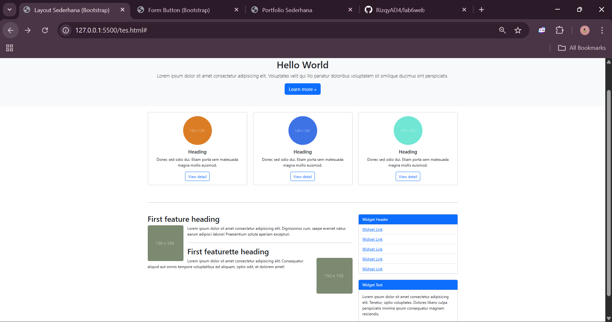
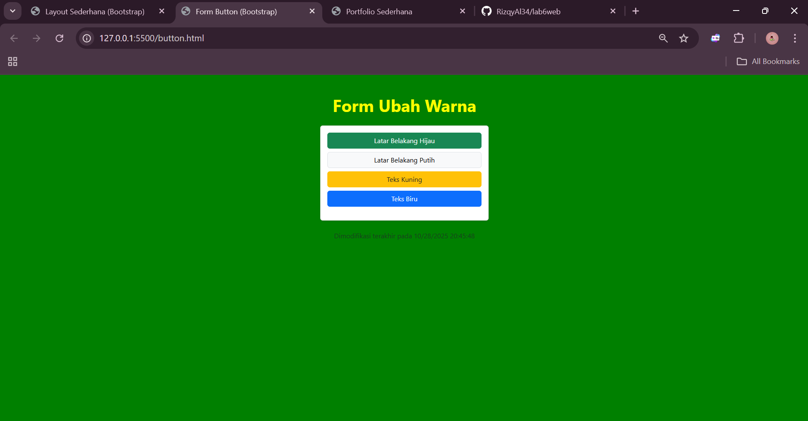
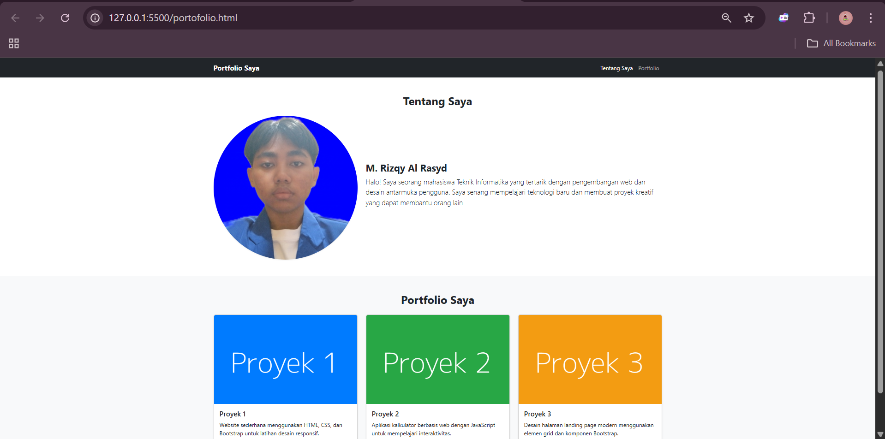

# lab6web

### Nama: M. Rizqy Al Rasyd
### Nim : 312410424
### Kelas : TI.24.A3

## REFACTOR LAYOUT PRAKTIKUM 4
# Code:
```     <!DOCTYPE html>
    <html lang="en">
    <head>
        <meta charset="UTF-8">
        <meta name="viewport" content="width=device-width, initial-scale=1.0">
        <title>Layout sederhana</title>
        <link rel="stylesheet" href="https://cdn.jsdelivr.net/npm/bootstrap@5.3.3/dist/css/bootstrap.min.css">
    </head>
    <body>
        <div id="container">
            <header>
                <h1>Layout Bootstrap</h1>
            </header>
            <nav>
                <a href="home.html" class="active">Home</a>
                <a href="artikel.html">Artikel</a>
                <a href="about.html">About</a>
                <a href="kontak.html">Kontak</a>
            </nav>
            <section id="hero">
                <h1>Hello World</h1>
                <p>Lorem ipsum dolor, sit amet consectetur adipisicing elit. Voluptates velit qui illo pariatur doloribus voluptatem sit similique ducimus sint perspiciatis nihil facilis maxime excepturi reprehenderit labore tenetur, dolorem earum necessitatibus.</p>
                <a href="home.html" class="btn btn-large">Learn more &raquo;</a>
            </section>
            <section id="wrapper">
                <section id="main">
                    <div class="row">
                        <div class="box">
                            
                            <h3>Heading</h3>
                            <p>Donec sed odio dui. Etiam porta sem malesuada magna mollis
            euismod.</p>
                            <a href="#" class="btn btn-default">View detail</a>
                    </div>
                    <div class="box">
                            
                            <h3>Heading</h3>
                            <p>Donec sed odio dui. Etiam porta sem malesuada magna mollis
            euismod.</p>
                            <a href="#" class="btn btn-default">View detail</a>
                    </div>
                    <div class="box">
                            
                            <h3>Heading</h3>
                            <p>Donec sed odio dui. Etiam porta sem malesuada magna mollis
            euismod.</p>
                            <a href="#" class="btn btn-default">View detail</a>
                        </div>
                    </div>
                    <hr class="divider" />
                    <article class="entry">
                        <h2>First feature heading</h2>
                        
                        <p>Lorem ipsum dolor sit, amet consectetur adipisicing elit. Dignissimos cum, saepe eveniet natus earum adipisci labore! Praesentium soluta aperiam excepturi, ratione similique est atque natus. Veniam quasi ea dolores aspernatur?</p>
                    </article>
                    <hr class="divider" />
                    <article class="entry">
                        <h2>First featurette heading</h2>
                        
                        <p>Lorem ipsum dolor sit amet consectetur adipisicing elit. Consequatur aliquid aut omnis tempore voluptatibus est aliquam, optio odit, et dolorem amet! Aliquam nisi a corrupti doloremque voluptate commodi nulla similique.</p>
                    </article>
                    </section>
                <aside id="sidebar">
                    <div class="widget-box">
                        <h3 class="title">Widget Header</h3>
                        <ul>
                            <li><a href="#">Widget Link</a></li>
                            <li><a href="#">Widget Link</a></li>
                            <li><a href="#">Widget Link</a></li>
                            <li><a href="#">Widget Link</a></li>
                            <li><a href="#">Widget Link</a></li>
                        </ul>    
                    </div>
                    <div class="widget-box">
                        <h3 class="title">Widget Text</h3>
                        <p>Lorem, ipsum dolor sit amet consectetur adipisicing elit. Tenetur, optio voluptates. Dolores libero culpa perspiciatis minima ipsum consequatur magnam reiciendis voluptas animi, quam sunt, deserunt eum. Dolorem quis magni perferendis.</p>
                    </div>
                </aside>
            </section>
            <footer>
            <p>&copy; 2021 - Universitas Pelita Bangsa</p>
            </footer>
        </div>
        <script src="https://cdn.jsdelivr.net/npm/bootstrap@5.3.3/dist/js/bootstrap.bundle.min.js"></script>
    </body>
    </html>
```

# Hasil:


## REFACTOR FORM PRAKTIKUM 5 BUTTON
# Code:
``` <!DOCTYPE html>
<html lang="en">
<head>
  <meta charset="UTF-8">
  <meta name="viewport" content="width=device-width, initial-scale=1.0">
  <title>Form Button (Bootstrap)</title>
  <link href="https://cdn.jsdelivr.net/npm/bootstrap@5.3.3/dist/css/bootstrap.min.css" rel="stylesheet">
  <link rel="stylesheet" href="button.css">
  <style>
    body {
      transition: background-color 0.5s, color 0.5s;
    }
  </style>
</head>
<body class="text-center py-5">

  <div class="container">
    <h1 class="mb-4 fw-bold">Form Ubah Warna</h1>

    <div class="card shadow-sm mx-auto" style="max-width: 400px;">
      <div class="card-body">
        <form>
          <div class="d-grid gap-2 mb-3">
            <button type="button" class="btn btn-success" onclick="ubahWarnaLB('green')">Latar Belakang Hijau</button>
            <button type="button" class="btn btn-light border" onclick="ubahWarnaLB('white')">Latar Belakang Putih</button>
            <button type="button" class="btn btn-warning text-dark" onclick="ubahWarnaLD('yellow')">Teks Kuning</button>
            <button type="button" class="btn btn-primary" onclick="ubahWarnaLD('blue')">Teks Biru</button>
          </div>
        </form>
      </div>
    </div>

    <p class="mt-4 text-muted" id="modified"></p>
  </div>

  <script>
    function ubahWarnaLB(warna) {
      document.body.style.backgroundColor = warna;
    }

    function ubahWarnaLD(warna) {
      document.body.style.color = warna;
    }

    document.getElementById("modified").innerText =
      "Dimodifikasi terakhir pada " + document.lastModified;
  </script>

  <script src="https://cdn.jsdelivr.net/npm/bootstrap@5.3.3/dist/js/bootstrap.bundle.min.js"></script>
</body>
</html>
```

# Hasil:


## PORTOFOLIO SEDERHANA
# Code:
``` <!DOCTYPE html>
<html lang="en">
<head>
  <meta charset="UTF-8">
  <meta name="viewport" content="width=device-width, initial-scale=1.0">
  <title>Form Button (Bootstrap)</title>
  <link href="https://cdn.jsdelivr.net/npm/bootstrap@5.3.3/dist/css/bootstrap.min.css" rel="stylesheet">
  <link rel="stylesheet" href="button.css">
  <style>
    body {
      transition: background-color 0.5s, color 0.5s;
    }
  </style>
</head>
<body class="text-center py-5">

  <div class="container">
    <h1 class="mb-4 fw-bold">Form Ubah Warna</h1>

    <div class="card shadow-sm mx-auto" style="max-width: 400px;">
      <div class="card-body">
        <form>
          <div class="d-grid gap-2 mb-3">
            <button type="button" class="btn btn-success" onclick="ubahWarnaLB('green')">Latar Belakang Hijau</button>
            <button type="button" class="btn btn-light border" onclick="ubahWarnaLB('white')">Latar Belakang Putih</button>
            <button type="button" class="btn btn-warning text-dark" onclick="ubahWarnaLD('yellow')">Teks Kuning</button>
            <button type="button" class="btn btn-primary" onclick="ubahWarnaLD('blue')">Teks Biru</button>
          </div>
        </form>
      </div>
    </div>

    <p class="mt-4 text-muted" id="modified"></p>
  </div>

  <script>
    function ubahWarnaLB(warna) {
      document.body.style.backgroundColor = warna;
    }

    function ubahWarnaLD(warna) {
      document.body.style.color = warna;
    }

    document.getElementById("modified").innerText =
      "Dimodifikasi terakhir pada " + document.lastModified;
  </script>

  <script src="https://cdn.jsdelivr.net/npm/bootstrap@5.3.3/dist/js/bootstrap.bundle.min.js"></script>
</body>
</html>
```

# Hasil:

